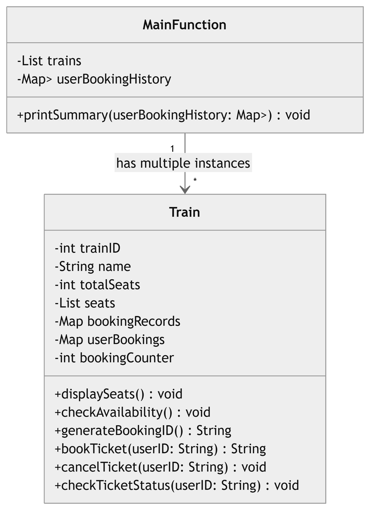
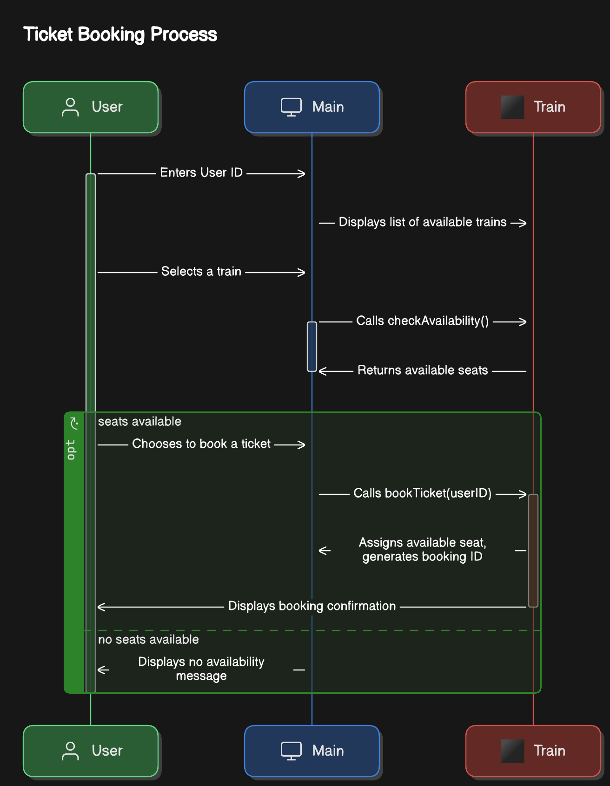
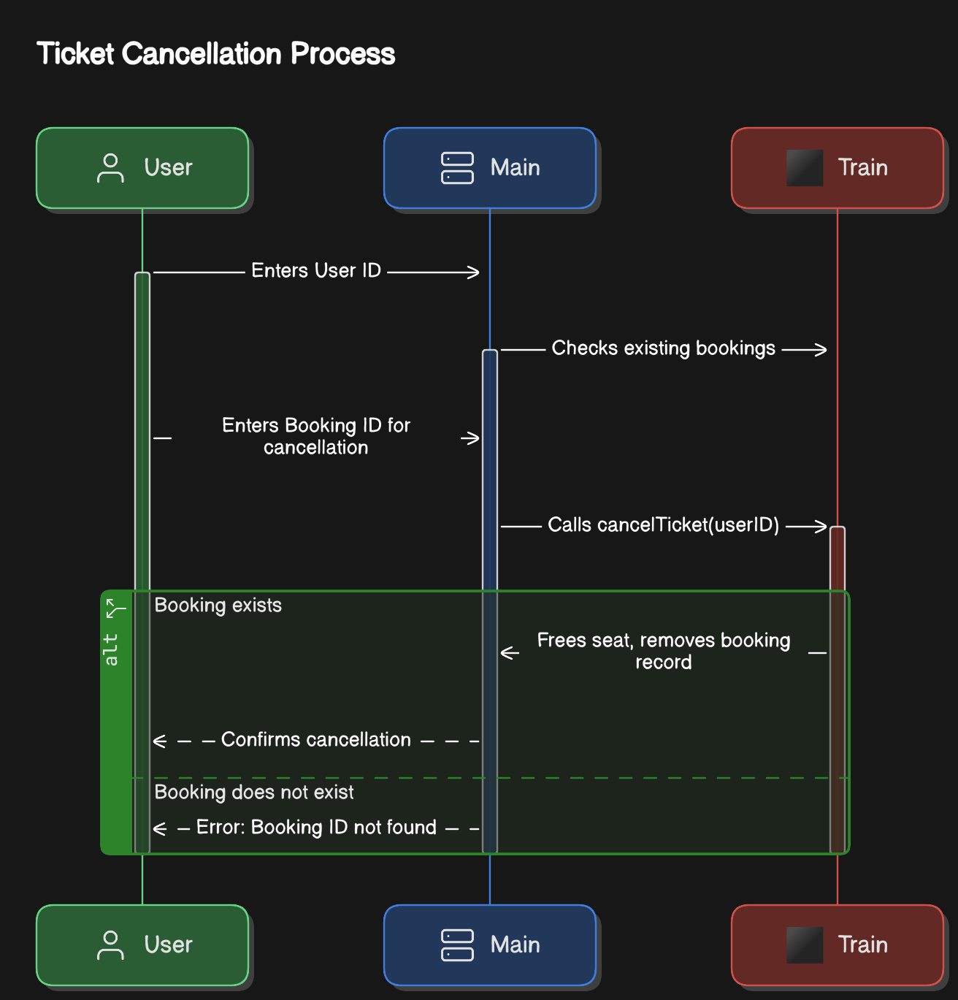
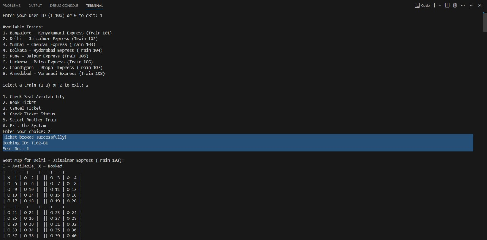
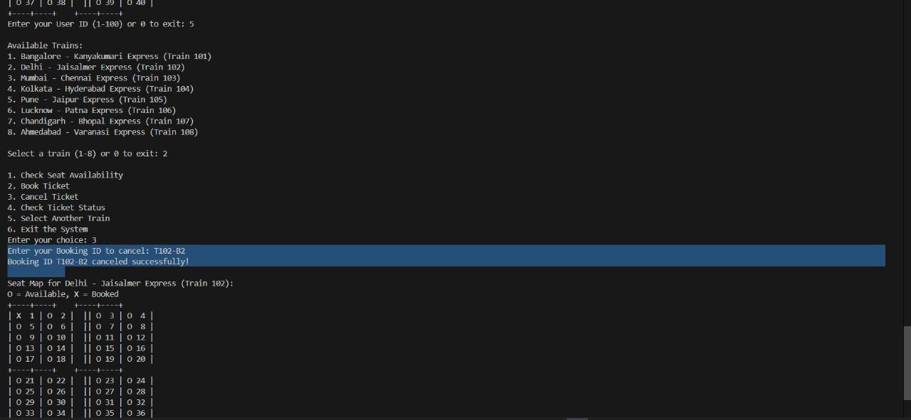
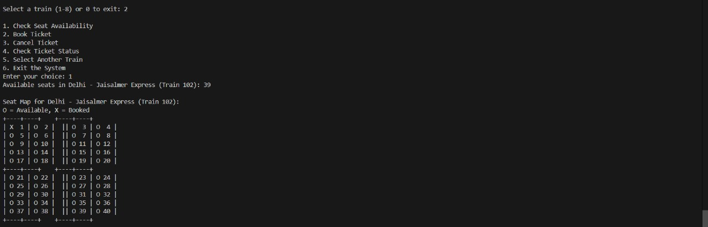
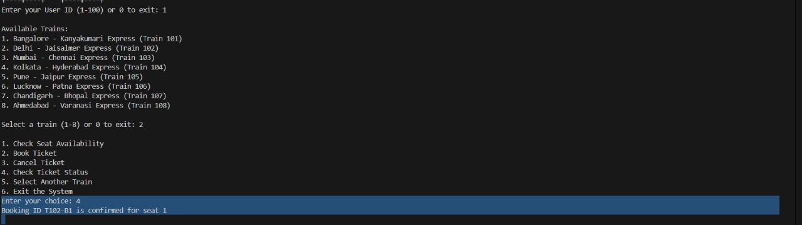
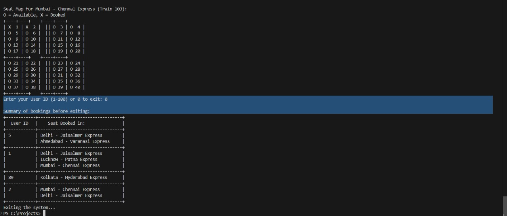

##
### Steps to run the System-
#### Option 1: Using an Online C++ Compiler
##### Steps to Run:
1. Go to [OnlineGDB C++ Compiler](https://www.onlinegdb.com/online_c++_compiler).
2. Upload all the files from the folder named **"railway_booking"** into the online compiler.
3. Click the **Run** button to execute the code.

#### Option 2: Using VS Code
##### Steps to Run:
1. Upload the folder named **"railway_booking"** into the VS Code.
2. Open the terminal and type following command:
   ```sh
   g++ main.cpp Train.cpp Booking.cpp Cancel.cpp Summary.cpp -o main
  
  and hit Enter.
  
3. Then type **./main.exe** and press Enter.

##
### Diagrams
#### Class Diagram:



#### Sequence Diagrams:
1. For Booking a Ticket-

2. For Cancelling a Ticket-


##
### Screenshots
#### 1. Booking a ticket:


#### 2. Cancelling a ticket:


#### 3. Checking seat availability:


#### 4. Seat confirmation:


#### 5. Showing summary of bookings:



